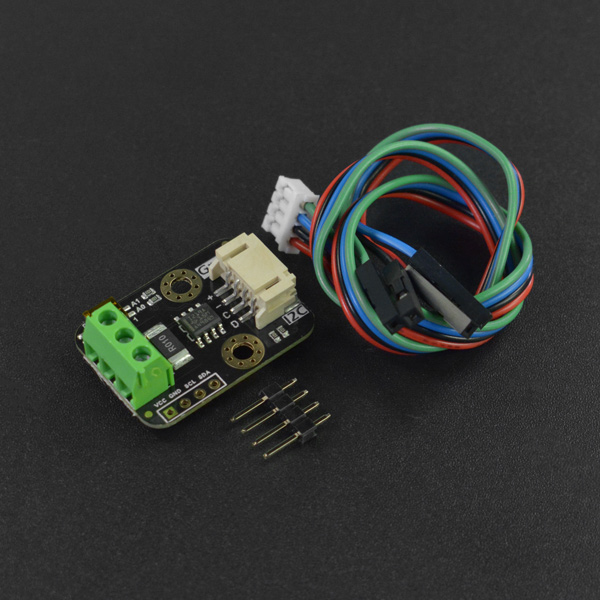

# DFRobot_INA219
- [English Version](./README.md)

  Gravity: I2C数字功率计是一款可测量26V 8A以内各类电子模块、用电设备的电压、电流和功率，最大相对误差不超过±0.2%的高分辨、高精度、大量程测量模块（使用前需进行一次简单的手动校准）。可用于太阳能系统、电池库仑计、电机、主控板或电子模块的功耗测量、电池续航评估与实时电源参数在线监控。




## 产品链接（https://www.dfrobot.com.cn/goods-1890.html）

    DFR0715：Gravity: I2C数字功率计

## 目录

  * [概述](#概述)
  * [库安装](#库安装)
  * [方法](#方法)
  * [兼容性](#兼容性)
  * [历史](#历史)
  * [创作者](#创作者)
## 概述

通过I2C读取INA219取样电阻两端的电压、电流、功率和电压。
这些数据通过串口输出。


## 库安装

要使用此库，请先下载库文件，并将其粘贴到\Arduino\libraries目录中
，然后打开示例文件夹并在该文件夹中运行demo。

## 方法

```python
  def begin(self):
    '''!
      @fn begin
      @brief 在读取数据之前,初始化I2C总线,配置INA219的配置寄存器
      @return True(成功)/False(失败)
    '''
  
  def linear_cal(self, ina219_reading_mA, ext_meter_reading_mA):
      '''!
        @fn linear_cal
        @brief 线性校准
        @param ina219_reading_mA    通过INA219测量得到的电流(未校准前)
        @param ext_meter_reading_mA  实际测量的电流
      '''
  
  def reset(self):
      '''!
        @fn reset
        @brief 复位配置寄存器
      '''

  def get_bus_voltage_V(self):
      '''!
        @fn get_bus_voltage_V
        @brief  获取 IN-相对GND电压
        @return 电压 单位:V
      '''

  def get_shunt_voltage_mV(self):
      '''
        @fn get_shunt_voltage_mV
        @brief  获取IN+相对IN-的两端电压
        @return 电压 单位:mV
      '''

  def get_current_mA(self):
      '''
        @fn get_current_mA
        @brief 获取流经IN+和IN-的电流
        @n 若电流从IN+流向IN-，电流值为正. 
        @n 若为电流从IN-流向IN+，电流值为负
        @return 电流 单位:mA
      '''

  def get_power_mW(self):
     '''
       @brief 获取功率
       @details 直接从模块读取到的功率分辨率为20mW（硬件方式），若使用语句“Power = 
       @n  BusVoltage*Current;”得到功率，其分辨率可提高至4mW（软件方式）。
       @return 功率 unit：mW
     '''

  def set_bus_RNG(self, value):
      '''
        @fn set_bus_RNG
        @brief  设置 BRNG参数(Bus Voltage Range)
        @param value     bus_vol_range_16V < 16V >
        @n               bus_vol_range_32V < 32V >
      '''

  def set_PGA(self, bits):
      '''
        @fn set_PGA
        @brief  设置 PGA参数
        @param bits          eIna219PGABits_1 <增益:1,量程 ±40 mV>
        @n                   eIna219PGABits_2 <增益:/2,量程 ±80 mV>
        @n                   eIna219PGABits_4 <增益:/4,量程 ±160 mV> 
        @n                   eIna219PGABits_8 <增益:/8,量程 ±320 mV> 
      '''

  def set_bus_ADC(self, bits, sample):
      '''!
        @fn set_bus_ADC
        @brief  设置 BADC参数
        @param bits           Resolution
        @n                    adc_bits_9,
        @n                    adc_bits_10,
        @n                    adc_bits_11,
        @n                    adc_bits_12
        @param sample         样本数
        @n                    adc_sample_1,
        @n                    adc_sample_2,
        @n                    adc_sample_4,
        @n                    adc_sample_8,
        @n                    adc_sample_16,
        @n                    adc_sample_32,
        @n                    adc_sample_64,
        @n                    adc_sample_128
      '''

  def set_shunt_ADC(self, bits, sample):
      '''!
        @fn set_shunt_ADC
        @brief  设置SADC参数
        @param bits           Resolution
        @n                    adc_bits_9,
        @n                    adc_bits_10,
        @n                    adc_bits_11,
        @n                    adc_bits_12
        @param sample         样本数
        @n                    adc_sample_1,
        @n                    adc_sample_2,
        @n                    adc_sample_4,
        @n                    adc_sample_8,
        @n                    adc_sample_16,
        @n                    adc_sample_32,
        @n                    adc_sample_64,
        @n                    adc_sample_128
      '''

  def set_mode(self, mode):
      '''
        @fn set_mode
        @brief  设置读取模式
        @param mode  
        @n                power_down,   <Power-down> 
        @n                shunt_vol_trig,    <Shunt voltage, triggered> 
        @n                bus_vol_trig,    <Bus voltage, triggered>  
        @n                shunt_and_bus_vol_trig,<Shunt and bus, triggered>  
        @n                adc_off,      <ADC off (disabled)> 
        @n                shunt_vol_con,     <Shunt voltage, continuous>  
        @n                bus_vol_con,     <Bus voltage, continuous>  
        @n                shunt_and_bus_vol_con   <Shunt and bus, continuous> 
      '''

  '''

```

## 兼容性

| 主板         | 通过 | 未通过 | 未测试 | 备注 |
| ------------ | :--: | :----: | :----: | :--: |
| RaspberryPi2 |      |        |   √    |      |
| RaspberryPi3 |      |        |   √    |      |
| RaspberryPi4 |  √   |        |        |      |

* Python 版本

| Python  | 通过 | 未通过 | 未测试 | 备注 |
| ------- | :--: | :----: | :----: | ---- |
| Python2 |  √   |        |        |      |
| Python3 |  √   |        |        |      |
## 历史

- 2022/3/1 - Version 1.0.0 released.

## 创作者

Written by fengli(li.feng@dfrobot.com), 2022.3.1 (Welcome to our [website](https://www.dfrobot.com/))